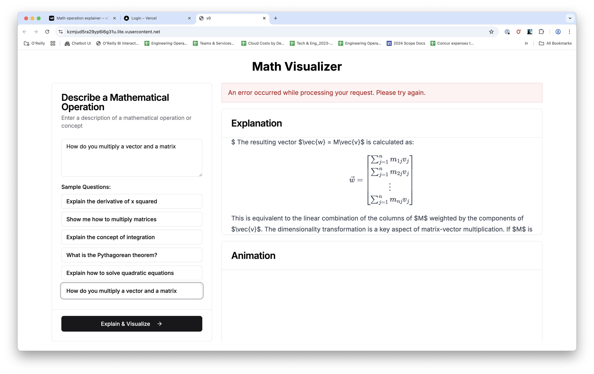
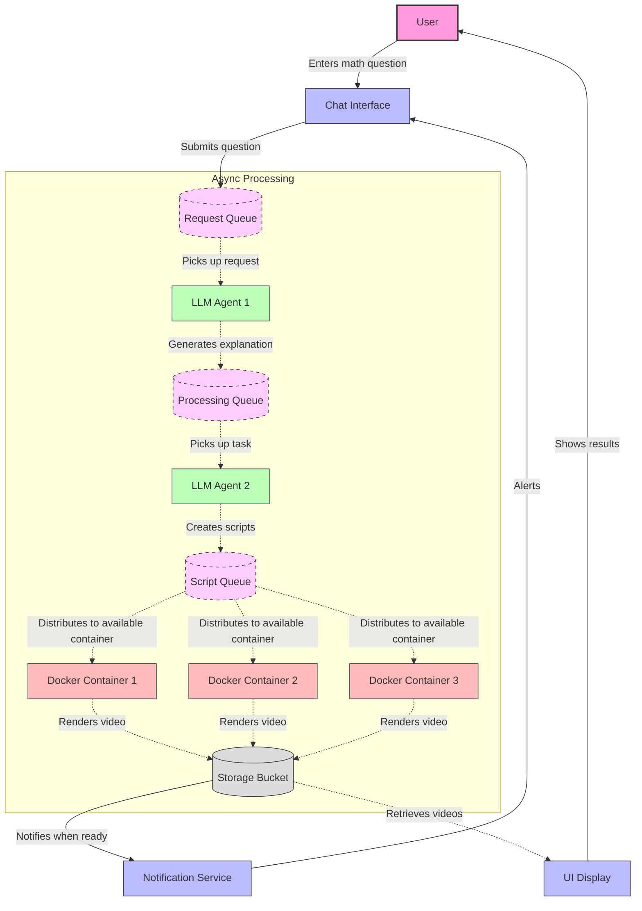

# animator

The goal of this project is to creat an way to create math visualizations in Manim using an LLM. The baisc UI will look like thhis:



The essential idea of the flow of the system is:

- A user enters a math quetsion in a chat box. To start, we will always default to "How do you multiply a matrix by a vector?"
- The users question is passed to an LLM angent for expansion. The goal of this is to create a text explanation interspersed with animations where appropriate.
- Once this initial text is generated it is passed to a second LLM agent that will create one or more manim scripts. Each script will be posted to a docker container that will generate an mp4 that is dropped onto a bucket.



## Dev setup

```
uv venv --python=3.10
source .venv/bin/activate
uv pip install -e .
```

You also need latex

### Building and running with docker

```
docker build -t mathlens .
```

docker run -p 5000:5000 \
 -v $(pwd):/app \
   -e OPENAI_API_KEY=$OPENAI_API_KEY \
 mathlens
